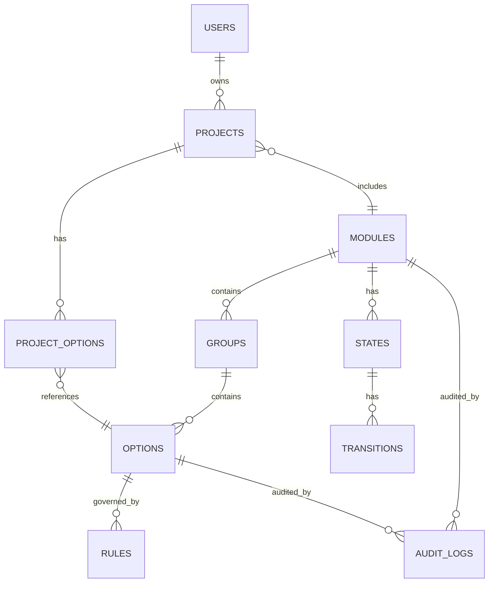
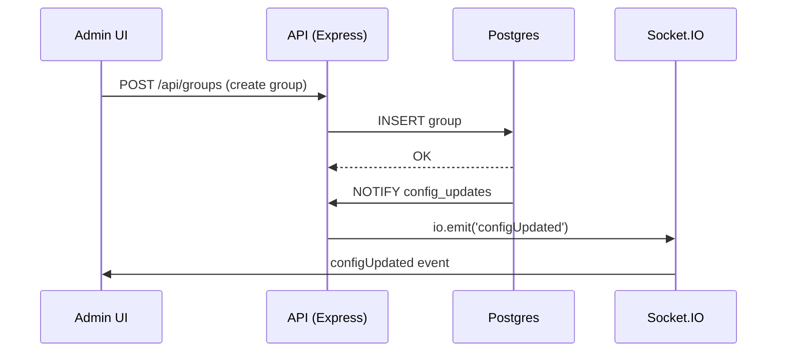
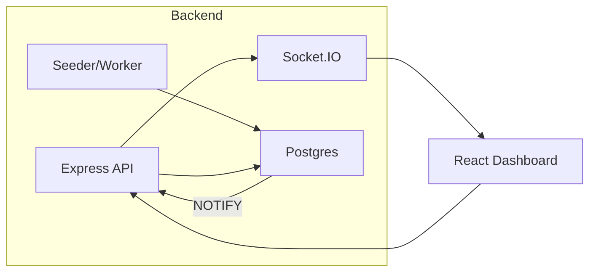

# STB Configuration System — Database Schema, ER Diagram & Implementation (A → Z)

> A single-source document that maps the entire database design, table structures, data flows, realtime sync, API design, seeding, and deployment notes for a dynamic STB modules/groups/options configuration system.

---

## 1. Project Summary

Goal: Build a dynamic, data-driven STB configuration platform where **Modules → Groups → Options** are stored in a database and the frontend (React dashboard) updates instantly when data is added/changed. The system supports rules/dependencies, project-specific option sets, versioning/auditing, and realtime updates (Socket.IO + DB triggers).

Scope:
- Relational DB design (PostgreSQL recommended)
- API layer (Node.js + Express)
- Realtime sync (Socket.IO + LISTEN/NOTIFY triggers)
- Frontend (React) dynamic rendering
- Admin seeder / ETL scripts to auto-load JSON configs
- Security, monitoring, and scaling guidance

---

## 2. High-level ER Diagram (mermaid)



> Use the mermaid block above in your markdown-capable viewer to visualize the relationships.

---

## 3. Table list & purpose

1. `users` — authentication & admin accounts
2. `modules` — top-level containers (Video, Network, Audio)
3. `groups` — sub-containers inside modules (Decoder, Renderer)
4. `options` — configurable features (H.264, HDR)
5. `states` — states for state-machine based options (optional)
6. `transitions` — allowed transitions for state machines
7. `rules` — dependency rules, requires/forbidden
8. `projects` — project-specific configuration sets (which options are included)
9. `project_options` — many-to-many mapping of projects ↔ options (and overrides)
10. `audit_logs` — record changes for traceability
11. `events` — realtime events log (optional persistence)
12. `seeds` — raw uploaded JSON (optional) for auditing imports

---

## 4. SQL: Example `CREATE TABLE` statements (PostgreSQL)

```sql
CREATE TABLE users (
  id SERIAL PRIMARY KEY,
  username VARCHAR(100) UNIQUE NOT NULL,
  email VARCHAR(255) UNIQUE,
  password_hash TEXT NOT NULL,
  role VARCHAR(50) DEFAULT 'admin',
  created_at TIMESTAMP WITH TIME ZONE DEFAULT now()
);

CREATE TABLE modules (
  id SERIAL PRIMARY KEY,
  key TEXT UNIQUE NOT NULL,    -- canonical id e.g. video_module
  name TEXT NOT NULL,
  description TEXT,
  active BOOLEAN DEFAULT true,
  initial_state TEXT,          -- optional
  meta JSONB DEFAULT '{}' ,    -- extensible metadata
  created_at TIMESTAMP WITH TIME ZONE DEFAULT now()
);

CREATE TABLE groups (
  id SERIAL PRIMARY KEY,
  module_id INT REFERENCES modules(id) ON DELETE CASCADE,
  key TEXT NOT NULL,
  name TEXT NOT NULL,
  description TEXT,
  position INT DEFAULT 0,
  meta JSONB DEFAULT '{}'
);

CREATE TABLE options (
  id SERIAL PRIMARY KEY,
  group_id INT REFERENCES groups(id) ON DELETE CASCADE,
  key TEXT NOT NULL,
  name TEXT NOT NULL,
  type VARCHAR(50) DEFAULT 'boolean', -- boolean, integer, string, enum
  default_value TEXT,
  editable BOOLEAN DEFAULT true,
  included_by_default BOOLEAN DEFAULT false,
  meta JSONB DEFAULT '{}', -- e.g. constraints, ui hints
  created_at TIMESTAMP WITH TIME ZONE DEFAULT now()
);

CREATE TABLE states (
  id SERIAL PRIMARY KEY,
  module_id INT REFERENCES modules(id) ON DELETE CASCADE,
  name TEXT NOT NULL
);

CREATE TABLE transitions (
  id SERIAL PRIMARY KEY,
  module_id INT REFERENCES modules(id) ON DELETE CASCADE,
  from_state TEXT NOT NULL,
  event TEXT NOT NULL,
  to_state TEXT NOT NULL,
  condition JSONB, -- optional condition expression
  meta JSONB DEFAULT '{}'
);

CREATE TABLE rules (
  id SERIAL PRIMARY KEY,
  option_id INT REFERENCES options(id) ON DELETE CASCADE,
  type VARCHAR(50) NOT NULL, -- 'requires' | 'forbidden' | 'validation'
  payload JSONB NOT NULL,    -- flexible: { requires: ['4k_enabled'] }
  active BOOLEAN DEFAULT true
);

CREATE TABLE projects (
  id SERIAL PRIMARY KEY,
  key TEXT UNIQUE NOT NULL,
  name TEXT NOT NULL,
  description TEXT,
  created_by INT REFERENCES users(id),
  created_at TIMESTAMP WITH TIME ZONE DEFAULT now(),
  meta JSONB DEFAULT '{}'
);

CREATE TABLE project_options (
  id SERIAL PRIMARY KEY,
  project_id INT REFERENCES projects(id) ON DELETE CASCADE,
  option_id INT REFERENCES options(id) ON DELETE CASCADE,
  included BOOLEAN DEFAULT true,
  value TEXT,               -- override value for editable options
  updated_at TIMESTAMP WITH TIME ZONE DEFAULT now()
);

CREATE TABLE audit_logs (
  id SERIAL PRIMARY KEY,
  entity_type VARCHAR(50) NOT NULL, -- 'module', 'group', 'option', 'project'
  entity_id INT,                     -- FK is optional, store referential id
  action VARCHAR(50) NOT NULL,       -- 'create','update','delete','seed'
  payload JSONB,
  actor INT REFERENCES users(id),
  created_at TIMESTAMP WITH TIME ZONE DEFAULT now()
);

CREATE TABLE seeds (
  id SERIAL PRIMARY KEY,
  filename TEXT,
  raw JSONB,
  imported_by INT REFERENCES users(id),
  imported_at TIMESTAMP WITH TIME ZONE DEFAULT now()
);

CREATE TABLE events (
  id SERIAL PRIMARY KEY,
  event_type TEXT NOT NULL,
  payload JSONB,
  created_at TIMESTAMP WITH TIME ZONE DEFAULT now()
);
```

---

## 5. Example: How data is stored

- Modules row: `{ id: 1, key: 'video_module', name: 'Video Module', initial_state: 'idle' }`
- Group row: `{ id: 10, module_id: 1, key: 'decoder_group', name: 'Decoder Settings' }`
- Option row: `{ id: 100, group_id: 10, key: 'hdr', name: 'HDR Support', type: 'boolean', default_value: 'false', editable: true }`
- Rule row: `{ id: 5, option_id: 100, type: 'requires', payload: { requires: ['4k_output'] } }

Project-specific mapping: `project_options` stores whether an option is included and any override value.

---

## 6. API Design (REST) — Minimal endpoints

**Auth**
- `POST /api/auth/login` → returns JWT

**Modules & structure**
- `GET /api/config` → returns full assembled config `{ modules: [...] }` (used by UI)
- `GET /api/modules` → list modules
- `POST /api/modules` → create module
- `PUT /api/modules/:id` → update module
- `DELETE /api/modules/:id` → delete module

**Groups/Options**
- `POST /api/modules/:moduleId/groups` → create group
- `POST /api/groups/:groupId/options` → create option
- `PUT /api/options/:id` → update option
- `DELETE /api/options/:id` → delete option

**Projects**
- `POST /api/projects` → create project (admin adds baseline)
- `GET /api/projects/:id/config` → project-specific assembled config (module + option included flags + overridden values)
- `PUT /api/projects/:id/options/:optionId` → toggle include / set override value

**Realtime**
- WebSocket / Socket.IO connection to receive events like `configUpdated`, `optionChanged`.

**Admin seeding**
- `POST /api/seed` → upload JSON and seed DB (returns audit log)

---

## 7. Backend Implementation Notes (Node.js + Express)

- Use an ORM (TypeORM / Prisma / Sequelize) for migrations + type safety.
- Architectural layers:
  - `controllers` → request handlers
  - `services` → business logic (assemble config, apply rules)
  - `repositories` → DB access
  - `realtime` → Socket.IO emit logic
  - `workers` → background jobs for seeding & ETL
- Use transactions when seeding complex module/group/option inserts.
- Sanitize `meta` and `payload` JSONB before saving.

Sample assemble algorithm for `/api/config` (pseudo):
1. SELECT modules (active)
2. For each module: SELECT groups WHERE module_id
3. For each group: SELECT options WHERE group_id
4. SELECT rules WHERE option_id IN (...) and attach
5. Optionally attach `project_options` if project param passed
6. Return hierarchical JSON

---

## 8. Real-time sync (Socket.IO + Postgres LISTEN/NOTIFY)

### A. Trigger & Notify in PostgreSQL (example)

```sql
CREATE OR REPLACE FUNCTION notify_config_change() RETURNS trigger AS $$
DECLARE
  payload JSON;
BEGIN
  payload = json_build_object(
    'table', TG_TABLE_NAME,
    'action', TG_OP,
    'id', NEW.id
  );
  PERFORM pg_notify('config_updates', payload::text);
  RETURN NEW;
END;
$$ LANGUAGE plpgsql;

CREATE TRIGGER options_change AFTER INSERT OR UPDATE OR DELETE ON options
  FOR EACH ROW EXECUTE FUNCTION notify_config_change();

-- create similar triggers for modules, groups, project_options, rules
```

### B. Node.js listen + Socket.IO emit

```js
// using 'pg' client
pgClient.on('notification', msg => {
  const payload = JSON.parse(msg.payload);
  io.emit('configUpdated', payload);
});

await pgClient.query('LISTEN config_updates');
```

Now, any change to `options`/`modules`/etc triggers a `configUpdated` event to all connected dashboard clients.

---

## 9. Seeder / ETL (JSON → DB)

**Purpose:** auto-import external configs as JSON (raw saved to `seeds` table). Seeder steps:
1. Validate JSON against a schema (AJV) before write
2. Save raw JSON to `seeds` table (for audit)
3. Insert / upsert modules → groups → options in a transaction
4. Insert transitions & rules
5. Insert audit log entries
6. Trigger NOTIFY (or simply rely on DB triggers already defined)

**Idempotence:** Use upsert (ON CONFLICT) so repeating the seed won't duplicate entries.

---

## 10. State Machine Storage & Execution

Options that require state-machine logic use `states` + `transitions` tables. On the backend:
- Build an in-memory state graph for the module when `/api/config` is requested.
- Use `transitions.condition` (JSON) for additional checks.
- For safety, evaluate conditions with a sandboxed expression evaluator (e.g., `jexl` with allowlist) or use json-logic.

---

## 11. Example: Full assembled JSON response returned by `/api/config`

```json
{
  "modules": [
    {
      "id": "video_module",
      "name": "Video Module",
      "initial": "idle",
      "groups": [
        {
          "id": 10,
          "name": "Decoder Settings",
          "options": [
            { "id": 100, "key": "h264", "name": "H.264", "editable": true, "included": true },
            { "id": 101, "key": "vp9", "name": "VP9", "editable": false, "included": false }
          ]
        }
      ],
      "rules": [ { "option_key": "hdr", "requires": ["4k_output"] } ],
      "states": { "idle": { "ENABLE_4K": "4k_enabled" } }
    }
  ]
}
```

---

## 12. Frontend (React) Implementation notes

- Fetch `/api/config` on load and create a normalized state client-side.
- Keep a Socket.IO connection open for `configUpdated` events.
- When event arrives, update the minimal part of state (merge) — do not refetch entire config unless necessary.
- Use virtualization if the UI can render large numbers of modules/options.
- Provide an Admin UI to add/edit modules/groups/options which call API and rely on realtime sync.

---

## 13. Sample API flow diagrams (mermaid)





---

## 14. Implementation Plan (A → Z milestones)

1. **Project scaffolding**: repo, CI, linter, env config
2. **DB schema & migrations** (use Prisma/TypeORM/Knex)
3. **Seed scripts** & sample JSON configs
4. **Express API**: config endpoints + auth
5. **Socket.IO integration** & PG LISTEN/NOTIFY wiring
6. **Admin UI**: create/edit modules/groups/options
7. **React Dashboard**: dynamic renderer + realtime merge logic
8. **Rules & validation engine** (json-logic/jexl) and tests
9. **Audit logging** & history view
10. **Integration tests & e2e**
11. **Deployment**: Docker, K8s manifests, CI pipelines
12. **Monitoring**: Prometheus, Grafana, Sentry

---

## 15. Security & Operational Considerations

- Use JWT + role-based access control for the admin APIs
- Sanitize and validate all JSONB payloads (AJV)
- Limit meta and rule expression languages to safe allowlists
- Use DB backups & PITR for Postgres
- For Socket.IO scale: use Redis adapter (pub/sub) across nodes
- Use TLS for all client-server comms

---

## 16. Example queries (useful)

- Get full module config with groups and options:
```sql
SELECT m.key AS module_key, g.id as group_id, g.name as group_name, o.id AS option_id, o.key AS option_key, o.name AS option_name
FROM modules m
JOIN groups g ON g.module_id = m.id
JOIN options o ON o.group_id = g.id
WHERE m.active = true
ORDER BY m.id, g.position, o.id;
```

- Upsert module (seed pattern):
```sql
INSERT INTO modules (key,name,initial_state,meta) VALUES ($1,$2,$3,$4)
ON CONFLICT (key) DO UPDATE SET name=EXCLUDED.name, initial_state=EXCLUDED.initial_state, meta=EXCLUDED.meta
RETURNING id;
```

---

## 17. Testing & QA

- Unit tests for rule evaluation (json-logic fixtures)
- Integration tests for API + DB (use testcontainers or ephemeral DB)
- E2E tests for realtime updates (use headless browser + socket mocks)
- Load testing for Socket.IO (k6 or Artillery)

---

## 18. Scaling & Performance

- Use connection pooling for Postgres (pg-pool)
- Use Redis adapter for Socket.IO across multiple backend instances
- Cache assembled config per project in Redis and invalidate on DB notify
- Avoid full-config refetches when small deltas suffice

---

## 19. Operational Scripts & Maintenance

- `scripts/seed.js` — idempotent seeder from `/configs/*.json`
- `scripts/sync_remote.js` — ETL job to pull remote configs
- `scripts/backup.sh` — DB dump and rotate
- `scripts/migrate.sh` — run migrations in CI/CD

---

## 20. Next steps / How I can help

- Provide full working **Express + Prisma** starter repo (with migrations and sample seed JSON).
- Provide a **React** admin + dashboard starter app wired to Socket.IO.
- Generate exact `CREATE TABLE` migration files for your chosen ORM.

---

*End of document.*

